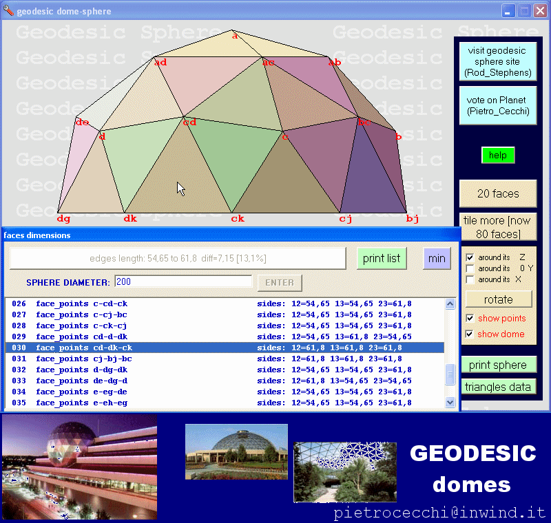



## design a geodesic dome

### Description

It shows you a polyhedron which, as the faces increase, approaches a sphere. The edges of the polyhedron are also calculated and reported for an easy construction of it.

Pure VB6, no DirectX.

Credits to Rod Stephens, www.vb-helper.com.

The basic polyhedron is the icosahedron (20 equal equilateral triangles as faces).

This application is based on an application downloaded from http://www.vb-helper.com/howto_geodesic_sphere.html done by Rod Stephens which performs all the calculations for the sphere points in 3D.

Rotations algorithms are at web page http://skal.planet-d.net/demo/maths.html ,paragraph '3D and Perpective transformations'.

My contribute has been essentially the addition of code for 3D display and animation.

This application should meet the needs and curiosity of many interested in geodesic building, such architects, civilian engineers and geometry students.

Sorry that the rotation of the sphere happens around its own axes and not around the fixed ones (the ones of the observer).

This is the reason why this is not a 3D virtual reality application.

I hope to do it in the next future.

NOTE that most of this code may be subject to Copyrights by the many who worked in many ways around this application.

To mention at least the most important of them, here follows the list:

Pietro Cecchi, pietrocecchi@inwind.it

Rod Stephens, feedback@vb-helper.com

I do have the posting permission from Rod Stephens, of course.

Even if most credits go to Rod Stephens, I will appreciate if you vote for me (or let's say: us) on Planet-source-code.

Thanks everybody and bye

Pietro Cecchi

KEYWORDS: tensegrity, tension, structures, triangles, tetrahedrons, icosahedron, sphere, rotation, 3D, virtual reality, Platon, geometry, graphics, poligons, building, domes, stadiums, botanic, geodesic, homes
 
### More Info
 

             |
---                |---
**Submitted On**   |2004-03-25 22:12:20
**By**             |[pietro ing\. cecchi](https://github.com/Planet-Source-Code/PSCIndex/blob/master/ByAuthor/pietro-ing-cecchi.md)
**Level**          |Advanced
**User Rating**    |5.0 (40 globes from 8 users)
**Compatibility**  |VB 6\.0
**Category**       |[Complete Applications](https://github.com/Planet-Source-Code/PSCIndex/blob/master/ByCategory/complete-applications__1-27.md)
**World**          |[Visual Basic](https://github.com/Planet-Source-Code/PSCIndex/blob/master/ByWorld/visual-basic.md)
**Archive File**   |[GEODESIC\_d1724553252004\.zip](https://github.com/Planet-Source-Code/pietro-ing-cecchi-design-a-geodesic-dome__1-52639/archive/master.zip)

